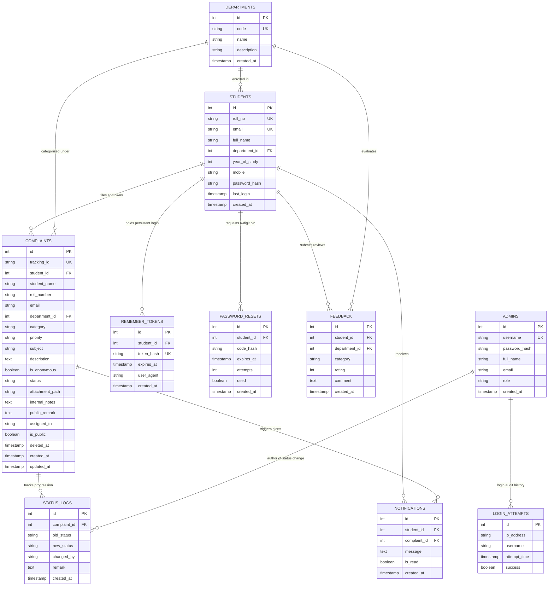

# System Architecture & Database Design
## College Complaint & Feedback Management System (Enterprise Student & Admin Editions)

This document describes the software architecture, design patterns, entity relationships, and device-aware pipeline implemented in the **College Complaint & Feedback Management System**.

---

## 1. Dual-Portal MVC Architecture & Filter Pipeline

The application adheres to the **Jakarta EE Model-View-Controller (MVC) Pattern** with two completely isolated application tiers:

```
                            +------------------------------------------------+
                            |              Browser / Client UI               |
                            |  [Phone <= 640px]   [Tablet]   [Laptop >= 1024]|
                            |  Bottom Nav, Wizard Public     Master-Detail   |
                            |  Touch Camera PWA   Wall       Admin Desk Triage
                            +------------------------------------------------+
                                            |                ^
                             HTTP Requests  |                | HTML / JSP Rendering
                            (GET/POST/SSE)  |                | & Scoped SSE Streams
                                            v                |
+-----------------------------------------------------------------------------------------------+
|                                 Global Security Filter Pipeline                               |
|  1. EncodingFilter (UTF-8)                                                                    |
|  2. SecurityHeadersFilter (X-Frame-Options: DENY, X-Content-Type-Options: nosniff, CSP)       |
|  3. DeviceDetectionFilter (User-Agent parser -> 'mobile' | 'tablet' | 'desktop')              |
|  4. CsrfFilter (Cryptographic token validation on all mutating POST/PUT/DELETE requests)      |
+-----------------------------------------------------------------------------------------------+
           |                                                                 |
   [/student/* Routes]                                               [/admin/* Routes]
           |                                                                 |
           v                                                                 v
+---------------------------------------+       +-----------------------------------------------+
|           StudentAuthFilter           |       |              AdminDeviceGuardFilter           |
| - Validates session.studentUser       |       | - Rejects phone clients (< 1024px) with       |
| - Auto-logins via REMEMBER_STUDENT    |       |   "Staff Desk is for Laptops" screen          |
| - Rejects admin sessions (403)        |       +-----------------------------------------------+
+---------------------------------------+                               |
           |                                                            v
           v                                            +-------------------------------+
+---------------------------------------+               |           AuthFilter          |
|        Student Controller Tier        |               | - Validates session.adminUser |
| - StudentHomeServlet                  |               | - Rejects student user (403)  |
| - StudentComplaintsServlet            |               | - Enforces SuperAdmin roles   |
| - StudentComplaintDetailServlet       |               +-------------------------------+
| - StudentNewComplaintServlet          |                               |
| - StudentNotificationsServlet         |                               v
| - StudentProfileServlet               |               +-------------------------------+
| - StudentLogin / Register / Reset     |               |      Admin Controller Tier    |
+---------------------------------------+               | - AdminDashboardServlet       |
                   |                                    | - AdminComplaintsServlet      |
                   |                                    | - AdminComplaintDetailServlet |
                   |                                    | - AdminFeedbackServlet        |
                   |                                    | - AdminManageUsersServlet     |
                   |                                    | - ExportCsvServlet            |
                   +-------------------+----------------+-------------------------------+
                                       |
                                       v
                    +-------------------------------------+
                    |      Model / Data Access Layer      |
                    | - StudentDAO      - ComplaintDAO    |
                    | - RememberTokenDAO- DepartmentDAO   |
                    | - PasswordResetDAO- StatusLogDAO    |
                    | - NotificationDAO - FeedbackDAO     |
                    | - AdminDAO        - POJOs & Entities|
                    +-------------------------------------+
                                       |
                         PreparedStatement Queries only
                         HikariCP Thread-Safe Connection Pool
                                       v
                    +-------------------------------------+
                    |          Database Storage           |
                    | - MySQL 8.x / Embedded H2           |
                    | - students, remember_tokens,        |
                    |   password_resets, notifications,   |
                    |   complaints, departments, admins,  |
                    |   status_logs, feedback, attempts   |
                    +-------------------------------------+
```

---

## 2. Scoped Real-Time Server-Sent Events (SSE) Flow

The real-time streaming engine uses Jakarta asynchronous processing (`req.startAsync()`) with strict channel authorization:

```
Student Portal (student-{id})           Public Board / Track (complaint-{id})              Admin Desk (admin-feed)
          |                                            |                                               |
          |--- GET /events?channel=student-1 --------->|                                               |
          |    (Requires session.studentUser == 1)     |                                               |
          |                                            |--- GET /events?channel=complaint-CMP-001 ---->|
          |                                            |                                               |--- GET /events?channel=admin-feed --->
          |                                            |                                               |    (Requires session.adminUser)
          |                                            |                                               |
          |                                            |                        Admin Updates Status   |
          |                                            |                        POST /admin/complaints/detail
          |                                            |                                               |
          |<=== event: studentNotification ============+===============================================|
          |     "Electrician dispatched to room"       |                                               |
          |                                            |<=== event: statusUpdate ======================|
          |                                            |     "In Progress" (Stamp thunks live)         |
          |                                            |                                               |<=== event: complaintUpdated ==========
          |                                            |                                               |     Audited in real-time feed
```

---

## 3. Entity-Relationship (ER) Diagram



---

## 4. Device Adaptation Architecture

The system achieves device adaptation without heavy JavaScript client-side frameworks:
1. **Server-Side Classification (`DeviceDetectionFilter`)**: Regex parses `User-Agent` headers into `mobile`, `tablet`, or `desktop`.
2. **Dynamic JSPF View Fragments**:
   - Phone (<= 640px): Includes `nav_mobile.jspf` (fixed bottom navigation bar, 4-step wizard with camera trigger).
   - Tablet (641px - 1024px): Responsive 2-column grid layout with collapsible filters.
   - Laptop / Desktop (>= 1025px): Top navigation bar, 2-column form with live updating ticket receipt preview, master-detail grievance grid with keyboard navigation (`N` for new, `/` for search).
3. **Admin Laptop Enforcement**:
   - `AdminDeviceGuardFilter` blocks mobile User-Agents from `/admin/*`.
   - `.admin-laptop-notice-overlay` activates via CSS media queries (`@media (max-width: 1023px)`) if a desktop browser window is resized below 1024px.
4. **Offline Resilience & Compression**:
   - Service Worker (`sw.js`) caches static CSS, fonts, and assets for offline use.
   - HTML5 Canvas in `student-form.js` compresses camera photos locally to <= 1600px edge before upload.
   - Browser `localStorage` persists in-progress complaint drafts to prevent lost data upon accidental tab closure.

---

## 5. Cloud Deployment & Container Architecture (Render + External Cloud MySQL)

The system is deployed as an enterprise containerized web service designed specifically for container platforms (Render, Railway, Fly.io) with ephemeral filesystems and strict resource limits:

`
                                    HTTPS Request (TLS 1.3)
                                               │
                                               ▼
                              ┌───────────────────────────────────┐
                              │     Render Cloud Edge Router      │
                              │  - Terminates TLS (SSL)           │
                              │  - Forwards X-Forwarded-For &     │
                              │    X-Forwarded-Proto=https        │
                              │  - Routes to internal PORT env    │
                              └─────────────────┬─────────────────┘
                                                │ HTTP / PORT
                                                ▼
┌────────────────────────────────────────────────────────────────────────────────────────┐
│ Render Docker Web Service (512 MB Cgroup Limit, Non-Root appuser:10001)                 │
│                                                                                        │
│  ┌──────────────────────────────────────────────────────────────────────────────────┐  │
│  │ Alpine Linux + Eclipse Temurin 21 JRE                                            │  │
│  │ JVM Flags: -Xms128m -Xmx320m -XX:MaxMetaspaceSize=128m -XX:+UseSerialGC          │  │
│  │                                                                                  │  │
│  │  ┌────────────────────────────────────────────────────────────────────────────┐  │  │
│  │  │ Embedded Apache Tomcat 10.1 (AppRunner)                                    │  │  │
│  │  │  - RemoteIpValve (Translates X-Forwarded-* to real client IP)             │  │  │
│  │  │  - Max Threads: 50 | Accept Count: 20 | Connection Timeout: 20s            │  │  │
│  │  │                                                                            │  │  │
│  │  │  ┌─────────────────────────┐           ┌────────────────────────────────┐  │  │  │
│  │  │  │   HealthCheckServlet    │           │     Jakarta Servlet Pipeline   │  │  │  │
│  │  │  │ - /healthz (Liveness)   │           │ - SecurityHeadersFilter (HSTS) │  │  │  │
│  │  │  │ - /healthz/db (Readiness│           │ - DeviceDetectionFilter        │  │  │  │
│  │  │  └─────────────────────────┘           │ - StudentAuth / AuthFilter     │  │  │  │
│  │  │                                        │ - EventStreamServlet (SSE)     │  │  │  │
│  │  │                                        │ - AttachmentServlet            │  │  │  │
│  │  │                                        └───────────────┬────────────────┘  │  │  │
│  │  └────────────────────────────────────────────────────────┼───────────────────┘  │  │
│  │                                                           │                      │  │
│  │                                                           ▼                      │  │
│  │                                    ┌──────────────────────────────────────────┐  │  │
│  │                                    │  HikariCP Cloud Connection Pool (Size=5) │  │  │
│  │                                    │  - maxLifetime=240s | keepalive=60s      │  │  │
│  │                                    │  - startup retry with backoff (60s)      │  │  │
│  │                                    └──────────────────────┬───────────────────┘  │  │
│  └───────────────────────────────────────────────────────────┼──────────────────────┘  │
└──────────────────────────────────────────────────────────────┼─────────────────────────┘
                                                               │ TLS / SSL Encrypted JDBC
                                                               ▼
                             ┌────────────────────────────────────────────────────┐
                             │    External Managed MySQL (TiDB Cloud / Aiven)     │
                             │  - Relational Schemas & Indexes                    │
                             │  - In-DB Binary Storage: complaint_attachments   │
                             │    (Survives container spin-downs & restarts)      │
                             └────────────────────────────────────────────────────┘
`

### Architectural Adaptations for Cloud & Containers
1. **Database-Backed Ephemeral Attachment Storage**:
   Containers on PaaS platforms have ephemeral filesystems; files written to disk vanish when the container restarts or re-deploys. When STORAGE_MODE=db, all uploaded grievance evidence files (JPEG, PNG, WEBP) are validated (magic bytes + SHA-256) and stored directly inside the complaint_attachments table as MEDIUMBLOB data, served via AttachmentServlet with 
osniff, Content-Disposition, and private cache headers.
2. **Reverse Proxy & Client IP Awareness**:
   Embedded Tomcat registers RemoteIpValve, seamlessly transforming X-Forwarded-For and X-Forwarded-Proto into native servlet values (
equest.getRemoteAddr(), 
equest.isSecure()). HttpUtil.getClientIp() inspects forwarded proxy headers to ensure the brute-force RateLimiter tracks the real remote client IP rather than the proxy edge IP.
3. **Low-Memory JVM Tuning**:
   To run smoothly within the 512 MB free container cgroup, the JVM uses Serial Garbage Collection (-XX:+UseSerialGC) which has almost zero memory overhead compared to G1GC, capped at -Xmx320m with Metaspace capped at 128 MB. Peak load testing with 50 concurrent threads and 20 SSE streams stabilizes at 191 MB RSS.
4. **Optimized Server-Sent Events (SSE) Behind Proxies**:
   Cloud reverse proxies buffer standard HTTP chunked responses. EventBroadcaster and EventStreamServlet inject X-Accel-Buffering: no, dispatch 15-second heartbeat comments (: keepalive\n\n), cap active connections to 50, and employ Last-Event-ID ring buffers for seamless client auto-reconnection.
5. **Two-Stage Health Checks**:
   /healthz provides an instant non-database ping (<5ms) for container orchestrator liveness checks (preventing false restarts during DB hiccups), while /healthz/db validates end-to-end database connectivity.
